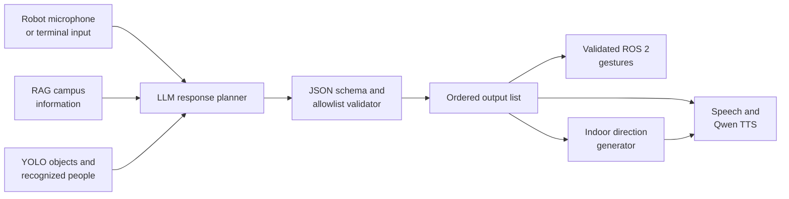

# BELT Project Presentation Template

Use this as an 8–10 minute presentation outline. Replace every item in
`[brackets]` with your information, keep slides visual, and delete the speaker
notes before submitting the slides.

---

## Slide 1 — Meet the Team and BELT

### Put on the slide

**BELT: A Multimodal AI Receptionist Robot**

- [Person 1 name] — [school]
- [Person 2 name] — [school]
- [Person 3 name] — [school]
- Mentor(s): [mentor name and role]

**One-sentence goal:** Make robot interactions more useful and natural by
combining conversation, campus information, directions, vision, speech, and
gestures.

**Visual:** One large photo of BELT with the team.

### Suggested opening

> Hello, we are [names] from [schools], and our mentor(s) are [names]. Our
> project is BELT, a friendly AI receptionist robot designed to talk with
> visitors, answer campus questions, give indoor directions, recognize its
> surroundings, and use gestures while speaking.

**Time:** 30–45 seconds

---

## Slide 2 — Problem, Background, and Related Work

### Put on the slide

**The problem**

- Visitors need quick answers and directions in an unfamiliar building.
- A normal chatbot cannot see, gesture, or interact through a physical robot.
- A robot response can become confusing if speech, directions, and gestures
  happen in the wrong order.
- Language models can invent facts or unsupported robot actions.

**Related approaches**

- Voice assistants provide conversational interaction.
- Social robots combine speech with physical behavior.
- Retrieval-augmented generation, or RAG, grounds answers in documents.
- Object detection and face recognition add environmental context.

**Our research question**

> How can we build a receptionist robot that gives grounded information and
> coordinates speech, directions, and safe gestures in one response?

**Visual:** A simple comparison with three columns: information kiosk,
chatbot, and BELT. Highlight that BELT combines physical and AI interaction.

### Speaker notes

Explain that BELT is not only a chatbot placed on a robot. The main challenge
was coordinating several systems while preventing unsupported actions and
irrelevant campus information from reaching the final response.

**Time:** 50–60 seconds

---

## Slide 3 — System Overview

### Put on the slide



**Key design idea:** Every response becomes one ordered list instead of
independent speech, gesture, and navigation outputs.

### Speaker notes

Walk from left to right. The user can speak through the robot or type in
terminal mode. RAG and computer vision add context. The LLM plans a response,
but a deterministic validator decides what is allowed. The final list controls
exactly when BELT speaks, gestures, and gives directions.

**Time:** 50–60 seconds

---

## Slide 4 — Coordinating Speech, Gestures, and Directions

### Put on the slide

```json
{
  "output_list": [
    {"type": "speech", "text": "Hi!"},
    {"type": "action", "name": "wave"},
    {"type": "speech", "text": "Here are your directions."},
    {"type": "navigation", "location": "2004"}
  ]
}
```

**Execution**

1. Say “Hi!”
2. Perform `wave`
3. Generate directions to room 2004
4. Speak “Here are your directions” and the full directions together

**Safety and consistency**

- Only allowlisted gestures can reach the robot.
- Only recognized destinations can reach navigation.
- Invalid events are removed before execution.
- Gestures execute in order with a cooldown.
- Terminal mode simulates gestures without calling ROS.

**Visual:** Animate or reveal each JSON event as its matching robot behavior
occurs.

### Speaker notes

Emphasize that raw model output is never trusted directly. For example, if the
model outputs an unsupported action such as `backflip`, validation discards it.
Standard gestures and approved custom gesture sequences are accepted.

**Time:** 60 seconds

---

## Slide 5 — Methodology: Grounded Campus Answers

### Put on the slide

**RAG pipeline**

1. Split campus information into 1,203 searchable chunks.
2. Encode documents and questions with MiniLM embeddings.
3. Compare the query and document vectors using cosine similarity.
4. Retrieve the three highest-scoring chunks.
5. Keep only chunks with a score of at least `0.30`.
6. Give accepted context to the response-planning LLM.

**Fine-tuning setup**

- Base model: `sentence-transformers/all-MiniLM-L6-v2`
- Question–chunk pairs: 600
- Split: 480 training, 60 validation, 60 testing
- Training: 3 epochs, batch size 16, learning rate `2e-5`
- Loss: Multiple Negatives Ranking Loss

**Example noise rejection**

`"hello belt"` produced a best score of `0.2412`, below the `0.30` threshold,
so no unrelated campus document was sent to the LLM.

**Visual:** Query → embedding → top three matches → threshold gate → LLM.

### Speaker notes

Explain cosine similarity in plain language: semantically similar text receives
a higher score. The threshold stops the system from treating every greeting as
a campus-information question.

**Time:** 60–75 seconds

---

## Slide 6 — Methodology: Robot and Multimodal Components

### Put on the slide

- **Language model:** Configurable DeepSeek or local OpenAI-compatible model
- **Computer vision:** YOLOv8n object detection
- **Face recognition:** InsightFace for enrolled people
- **Speech generation:** Qwen3-TTS 0.6B CustomVoice
- **Robot communication:** ROS 2 topics for microphone input, audio, camera,
  and arm gestures
- **Navigation:** Valid room allowlist plus rule-based indoor directions
- **Reliability:** Camera failure fallback, schema validation, gesture
  cooldowns, and terminal simulation mode

**Visual:** Use six icons around a central picture of BELT. Avoid putting code
on this slide.

### Speaker notes

Explain why the project uses both learned and rule-based methods. Models are
useful for language, retrieval, and perception, while validation, movement
allowlists, cooldowns, and room directions need predictable behavior.

**Time:** 50–60 seconds

---

## Slide 7 — Results

### Put on the slide

**RAG retrieval on 60 held-out questions**

| Metric | Base MiniLM | Fine-tuned MiniLM | Change |
|---|---:|---:|---:|
| Top-1 accuracy | 50.0% | 53.3% | +3.3 points |
| Top-3 accuracy | 75.0% | 80.0% | +5.0 points |
| Top-5 accuracy | 81.7% | 85.0% | +3.3 points |
| Top-10 accuracy | 86.7% | 93.3% | +6.7 points |
| MRR@10 | 0.644 | 0.688 | +0.044 |
| nDCG@10 | 0.699 | 0.748 | +0.049 |

**System validation**

- 22 automated tests passed for the current integrated response pipeline.
- Tests cover ordered speech/actions/navigation, invalid action filtering,
  gesture cooldowns, navigation output, audio publication, and terminal mode.

**Still to measure before presenting**

- Average end-to-end response time: `[___ seconds, n=___ trials]`
- Supported request success rate: `[___%, n=___ requests]`
- Object/face-recognition result: `[metric or qualitative demo result]`
- Physical gesture success rate: `[___%, n=___ gestures]`

**Visual:** Replace or accompany the table with a grouped bar chart comparing
base and fine-tuned Top-1, Top-3, Top-5, and Top-10 accuracy.

### Speaker notes

Top-3 accuracy means that the correct campus document appeared within the first
three retrieved results. The increase from 75% to 80% means the fine-tuned
retriever found the correct document in its first three choices more often.
Do not describe unmeasured CV, latency, or robot performance as an accuracy
result; collect those numbers or present them as a demo.

**Time:** 75–90 seconds

---

## Slide 8 — Live Demo or Demo Video

### Put on the slide

**Suggested 45–60 second demo**

1. “Hello, BELT.”  
   Show that irrelevant RAG context is rejected.
2. “Wave, then tell me how to get to room 2004.”  
   Show ordered speech → gesture → directions.
3. “What do you see?”  
   Show a vision-aware response if the camera is available.
4. Optional: show the same interaction in terminal simulation mode.

**Backup plan**

- Record the successful demo in advance.
- Add captions showing the validated `output_list`.
- Keep the video under one minute.
- Have screenshots ready in case the robot or network is unavailable.

**Visual:** Demo video plus a small overlay of the ordered output list.

### Speaker notes

State what the audience should watch for before starting: grounded information,
the action occurring between spoken segments, and navigation directions being
merged into speech.

**Time:** 60 seconds

---

## Slide 9 — Limitations and Future Work

### Put on the slide

| Current limitation | Future improvement |
|---|---|
| RAG Top-1 accuracy is 53.3% | Expand and clean training pairs; compare embedding models |
| A fixed `0.30` threshold may not fit every query | Calibrate the threshold on a labeled rejection set |
| Navigation uses a fixed indoor map and spoken directions | Connect the BELT app and add live localization |
| Gestures use a fixed allowlist | Add and test more safe gesture sequences |
| The local LLM depends on another reachable computer | Deploy a smaller quantized model on the robot computer |
| Vision depends on camera quality and enrolled faces | Evaluate under different lighting, angles, and distances |
| Multiple models can increase response latency | Profile each stage and run independent stages concurrently |
| Current evaluation emphasizes components | Run an end-to-end study with real visitors |

**Visual:** Use four paired “limitation → next step” cards rather than showing
the entire table if the slide becomes crowded.

### Speaker notes

Choose the three or four limitations most important to your team. Explain them
as engineering opportunities, not excuses. Mention that retrieval accuracy
does not by itself measure the quality of the complete human–robot interaction.

**Time:** 60 seconds

---

## Slide 10 — Conclusion

### Put on the slide

**What we built**

- A multimodal receptionist system for BELT
- Grounded campus answers using thresholded RAG
- One validated, ordered format for speech, gestures, and navigation
- Robot and terminal modes for development and demonstration

**Why it matters**

BELT demonstrates how learned AI models and deterministic safety checks can
work together to make physical human–robot interaction more useful,
understandable, and reliable.

**What we learned**

- [Technical lesson]
- [Teamwork/research lesson]
- [Unexpected lesson]

**Final line**

> Our project moved BELT from separate AI features toward one coordinated
> receptionist experience. Thank you—we are happy to answer questions.

**Visual:** Return to the team-and-robot photo from Slide 1.

**Time:** 30–45 seconds

---

# Backup Slides

## Backup A — Models and Algorithms

- MiniLM embeddings and cosine-similarity retrieval
- Multiple Negatives Ranking Loss for retriever fine-tuning
- Local or DeepSeek language-model backend
- Strict JSON parsing and allowlist validation
- YOLOv8n object detection
- InsightFace face recognition
- Qwen3-TTS 0.6B CustomVoice
- Rule-based room navigation
- ROS 2 communication

## Backup B — Validated Event Types

| Event | Required fields | Result |
|---|---|---|
| Speech | `type`, `text` | Buffered and spoken |
| Action | `type`, valid `name` | Gesture or terminal simulation |
| Navigation | `type`, valid `location` | Directions added to speech |

## Backup C — Evaluation Definitions

- **Top-k accuracy:** Percentage of questions whose correct document appears
  in the first `k` results.
- **MRR:** Rewards systems that rank the first correct result near the top.
- **nDCG:** Measures ranking quality while giving more weight to early results.
- **Cosine similarity:** Measures how closely two embedding vectors point in
  the same direction.

---

# Questions to Prepare For

1. **Why use RAG instead of relying only on the LLM?**  
   RAG gives the model relevant campus documents and reduces unsupported
   answers about local information.

2. **Can the LLM make BELT perform any movement?**  
   No. The prompt requests supported movements, and deterministic validation
   removes everything outside the standard and custom allowlists.

3. **What happens if the model returns invalid JSON?**  
   BELT falls back to a safe speech-only response instead of executing the
   malformed output.

4. **Why combine speech, actions, and navigation into one list?**  
   The ordered list preserves timing. BELT can speak, gesture, and continue
   speaking without separate modules racing or producing an unnatural order.

5. **Does BELT physically navigate to a room?**  
   The current system provides spoken indoor directions. Actual navigation is
   a future integration with the BELT app and robot localization.

6. **Does the local language model run directly on the robot?**  
   Not currently. BELT calls an OpenAI-compatible model server on a reachable
   computer. Robot mode and language-model backend selection are separate.

7. **What does 80% Top-3 accuracy mean?**  
   For 80% of the 60 held-out questions, the correct chunk was among the first
   three retrieved results.

8. **What is the largest remaining challenge?**  
   `[Choose one: end-to-end reliability, latency, navigation, retrieval
   accuracy, or perception—and explain why.]`

---

# Practice Checklist

- Replace every `[placeholder]`.
- Keep the main deck to about ten slides.
- Use at least 28-point body text.
- Keep each slide to one main idea.
- Practice once for content, once with a timer, and once with the demo.
- Assign which person presents each slide.
- Target `[presentation limit minus 30 seconds]` to leave a buffer.
- Record real latency and demo-success measurements before adding claims.
- Keep a prerecorded demo and screenshots available.
- Practice the eight questions above and one follow-up question for each.
- Confirm the local LLM server, ROS 2 nodes, camera, and robot topics before
  presenting.
